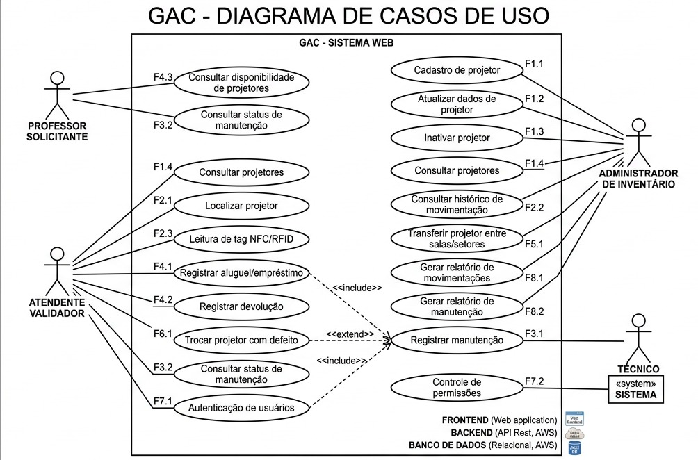

# Modelo de Caso de Uso – Diagrama de Casos de Uso do Sistema GAC

Última atualização em 18/05/2026  

## 1. O que é este artefato?

Este artefato documenta o **diagrama de casos de uso** do sistema GAC (Gestão de Ativos CCT), apresentando, em nível de alto nível, as funcionalidades que o sistema oferece e como elas se relacionam com os atores identificados na Visão da Demanda.  
Ele serve como visão geral do comportamento esperado da solução, sendo base para a elaboração das especificações detalhadas de casos de uso (CDU).

## 2. Objetivo do diagrama

Apresentar, de forma visual, as interações entre:

- Os **atores** do sistema GAC (Professor Solicitante, Atendente Validador, Administrador de Inventário e Técnico), e  
- Os **casos de uso** (F1.1 a F8.2) definidos na Visão da Demanda,

de modo que seja possível:

- Compreender rapidamente **o que** o sistema faz do ponto de vista do usuário;
- Validar se todas as funcionalidades levantadas (requisitos funcionais) estão contempladas;
- Apoiar a escrita posterior das especificações de casos de uso (fluxos principais, alternativos e de exceção).

## 3. Diagrama de Casos de Uso do GAC

A figura a seguir apresenta o diagrama de casos de uso do sistema GAC.

**Legenda de arquitetura (contexto da solução):**

- **FRONTEND**: aplicação web (sistema GAC – Sistema Web)  
- **BACKEND**: API REST hospedada na AWS  
- **BANCO DE DADOS**: banco relacional hospedado na AWS  

## 4. Atores

Conforme a Visão da Demanda, os atores representados no diagrama são:

- **Professor Solicitante**  
  - Usuário final que necessita utilizar projetores nas atividades acadêmicas.  
  - Interage principalmente para consultar disponibilidade e status de manutenção.

- **Atendente Validador**  
  - Responsável pelo registro e controle operacional das movimentações dos projetores.  
  - Executa as operações de empréstimo, devolução, leitura de tags e substituição de projetores defeituosos.

- **Administrador de Inventário**  
  - Responsável pela gestão global dos ativos e de seus dados cadastrais.  
  - Cadastra, atualiza, inativa projetores, consulta histórico e gera relatórios.

- **Técnico**  
  - Responsável por registrar as manutenções dos projetores.  

- **Sistema (<<system>>) – Controle de permissões**  
  - Ator interno que representa o comportamento automático do sistema ao aplicar regras de permissão conforme perfil do usuário (caso de uso F7.2).

## 5. Casos de Uso representados

Todos os requisitos funcionais levantados na Visão da Demanda (seção 6) estão presentes no diagrama, mantendo o mesmo identificador e nome:

### Necessidade 1 – Gerenciar cadastro de projetores

- **F1.1 – Cadastro de projetor**  
  Ator: Administrador de Inventário  

- **F1.2 – Atualizar dados de projetor**  
  Ator: Administrador de Inventário  

- **F1.3 – Inativar projetor**  
  Ator: Administrador de Inventário  

- **F1.4 – Consultar projetores**  
  Atores: Administrador de Inventário, Atendente Validador  

### Necessidade 2 – Rastrear projetores

- **F2.1 – Localizar projetor**  
  Ator: Atendente Validador  

- **F2.2 – Consultar histórico de movimentação**  
  Ator: Administrador de Inventário  

- **F2.3 – Leitura de tag NFC/RFID**  
  Ator: Atendente Validador  

### Necessidade 3 – Gerenciar manutenção de projetores

- **F3.1 – Registrar manutenção**  
  Atores: Técnico, Administrador de Inventário  

- **F3.2 – Consultar status de manutenção**  
  Atores: Professor Solicitante, Atendente Validador  

### Necessidade 4 – Gerenciar empréstimo de projetores

- **F4.1 – Registrar aluguel/empréstimo**  
  Ator: Atendente Validador  

- **F4.2 – Registrar devolução**  
  Ator: Atendente Validador  

- **F4.3 – Consultar disponibilidade**  
  Atores: Professor Solicitante, Atendente Validador  

### Necessidade 5 – Realocar projetores

- **F5.1 – Transferir projetor entre salas/setores**  
  Ator: Administrador de Inventário  

### Necessidade 6 – Substituir projetores defeituosos

- **F6.1 – Trocar projetor com defeito**  
  Ator: Atendente Validador  

### Necessidade 7 – Acesso e segurança

- **F7.1 – Autenticação de usuários**  
  Atores: Administrador de Inventário, Atendente Validador  

- **F7.2 – Controle de permissões**  
  Ator: Sistema (<<system>>)  

### Necessidade 8 – Relatórios e auditoria

- **F8.1 – Gerar relatório de movimentações**  
  Ator: Administrador de Inventário  

- **F8.2 – Gerar relatório de manutenção**  
  Ator: Administrador de Inventário  

## 6. Relações entre casos de uso (include / extend)

No diagrama são representadas relações de reuso entre casos de uso, seguindo as diretrizes do artefato de Casos de Uso:

- **«include» F3.1 – Registrar manutenção**  
  - Reutilizado a partir de:
    - **F4.1 – Registrar aluguel/empréstimo**  
    - **F4.2 – Registrar devolução**  
  - Justificativa: sempre que for necessário registrar uma manutenção (por exemplo, ao identificar defeito durante o empréstimo ou devolução), o fluxo de F4.1 ou F4.2 inclui o comportamento padronizado de F3.1.

- **«extend» F3.1 – Registrar manutenção**  
  - Estendido por:
    - **F6.1 – Trocar projetor com defeito**  
  - Justificativa: a troca de um projetor com defeito é um cenário opcional que parte de uma manutenção registrada, adicionando passos complementares para vincular um novo projetor ao usuário.

Essas relações serão detalhadas posteriormente em cada especificação de caso de uso (CDU), indicando os pontos de inclusão e extensão no fluxo.

## 7. Relação com requisitos funcionais e não funcionais

- **Requisitos funcionais:**  
  - Todos os casos de uso F1.1 a F8.2 definidos na Visão da Demanda estão presentes e associados aos atores corretos.
- **Requisitos não funcionais:**  
  - Não são representados graficamente no diagrama, conforme a técnica de casos de uso, mas são considerados nos demais artefatos (Visão da Demanda e futuras especificações de casos de uso), especialmente quanto a:
    - Rastreabilidade em tempo real;  
    - Segurança e controle de permissões;  
    - Centralização e integridade dos dados.

## 8. Checklist de validação deste artefato

- [x] Todos os atores da Visão da Demanda foram representados.  
- [x] Todos os casos de uso F1.1 a F8.2 foram incluídos e associados a pelo menos um ator.  
- [x] As relações de include/extend possuem justificativa conceitual para reuso de comportamento.  
- [x] O diagrama está coerente com a arquitetura descrita na Visão da Demanda (frontend, backend, banco de dados na AWS).  
- [x] O artefato está alinhado ao modelo de documentação de casos de uso fornecido pelo professor.  

---
