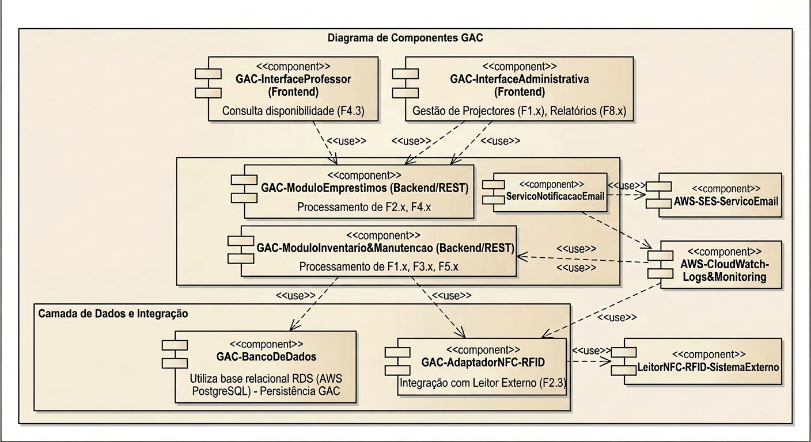

# Diagrama de Componentes do Sistema GAC

Última atualização em 18/05/2026  

## 1. Objetivo do artefato

Este artefato descreve o **diagrama de componentes** do sistema GAC (Gestão de Ativos CCT).  
O diagrama mostra **como a solução está organizada em módulos de software** (frontend, backend e integrações) e **como esses módulos se relacionam** para implementar as funcionalidades F1.1 a F8.2 descritas na Visão da Demanda.

## 2. Diagrama de Componentes do GAC

A figura a seguir apresenta o diagrama de componentes do sistema GAC.

---

## 3. Componentes de Frontend

### 3.1 `GAC-InterfaceProfessor (Frontend)`

- **Tipo:** `<<component>>`
- **Responsabilidade principal:**  
  - Interface web usada pelo **Professor Solicitante**.
- **Funcionalidades suportadas:**  
  - Consulta de disponibilidade de projetores (F4.3).
- **Relações:**  
  - Usa os componentes de backend (`GAC-ModuloEmprestimos`) para obter dados de disponibilidade.

### 3.2 `GAC-InterfaceAdministrativa (Frontend)`

- **Tipo:** `<<component>>`
- **Responsabilidade principal:**  
  - Interface web utilizada pelo **Administrador de Inventário** e **Atendente Validador**.
- **Funcionalidades suportadas:**  
  - Gestão de projetores (F1.x).  
  - Acesso a relatórios (F8.x).
- **Relações:**  
  - Usa `GAC-ModuloInventario&Manutencao` para operações de cadastro, atualização, inativação e transferência.  
  - Usa `GAC-ModuloEmprestimos` para empréstimos/devoluções e consultas ligadas a disponibilidade.  

---

## 4. Componentes de Backend (Processamento / API REST)

### 4.1 `GAC-ModuloEmprestimos (Backend/REST)`

- **Tipo:** `<<component>>`
- **Responsabilidade principal:**  
  - Processamento das funcionalidades relacionadas a **rastreio e empréstimos**.
- **Funcionalidades apoiadas:**  
  - F2.x – Rastrear projetores (localização, histórico, leitura de tag).  
  - F4.x – Gerenciar empréstimos (registro de aluguel, devolução, consulta de disponibilidade).
- **Relações:**  
  - É usado pelas interfaces `GAC-InterfaceProfessor` e `GAC-InterfaceAdministrativa`.  
  - Usa `GAC-BancoDeDados` para persistir movimentações.  
  - Usa `GAC-AdaptadorNFC-RFID` para operações de leitura de tag (F2.3).  
  - Usa `ServicoNotificacacEmail` para envio de notificações (quando aplicável).  
  - Pode registrar logs e métricas via `AWS-CloudWatch-Logs&Monitoring`.

### 4.2 `GAC-ModuloInventario&Manutencao (Backend/REST)`

- **Tipo:** `<<component>>`
- **Responsabilidade principal:**  
  - Processamento das funcionalidades de **inventário, manutenção e realocação**.
- **Funcionalidades apoiadas:**  
  - F1.x – Gerenciar cadastro de projetores (cadastro, atualização, inativação, consulta).  
  - F3.x – Gerenciar manutenção (registro e consulta de status).  
  - F5.x – Realocar projetores entre salas/setores.
- **Relações:**  
  - É usado pela `GAC-InterfaceAdministrativa`.  
  - Usa `GAC-BancoDeDados` para persistência de projetores, estados e manutenções.  
  - Usa `GAC-AdaptadorNFC-RFID` para relacionar dados lidos via tags com os registros de inventário.  
  - Usa `ServicoNotificacacEmail` quando há necessidade de notificar usuários.  
  - Usa `AWS-CloudWatch-Logs&Monitoring` para logs e monitoramento.

---

## 5. Camada de Dados e Integração

### 5.1 `GAC-BancoDeDados`

- **Tipo:** `<<component>>`
- **Responsabilidade principal:**  
  - Camada de acesso e persistência de dados do sistema GAC.
- **Descrição no diagrama:**  
  - “Utiliza base relacional RDS (AWS PostgreSQL) – Persistência GAC”.
- **Dados armazenados:**  
  - Projetores (F1.x).  
  - Movimentações e histórico (F2.x, F4.x, F5.1).  
  - Registros de manutenção (F3.x, F6.1).  
  - Dados para relatórios (F8.x).  
  - Dados de autenticação/perfis (ligados a F7.x, quando aplicável).
- **Relações:**  
  - É usado por `GAC-ModuloEmprestimos` e `GAC-ModuloInventario&Manutencao`.

### 5.2 `GAC-AdaptadorNFC-RFID`

- **Tipo:** `<<component>>`
- **Responsabilidade principal:**  
  - Adaptador de integração entre o backend GAC e o **sistema externo de leitor NFC/RFID**.
- **Funcionalidade suportada:**  
  - F2.3 – Leitura de tag NFC/RFID.
- **Relações:**  
  - É usado por `GAC-ModuloEmprestimos` e `GAC-ModuloInventario&Manutencao`.  
  - Usa o componente externo `LeitorNFC-RFID-SistemaExterno`.

### 5.3 `LeitorNFC-RFID-SistemaExterno`

- **Tipo:** `<<component>>` (sistema externo)
- **Responsabilidade principal:**  
  - Dispositivo/sistema responsável pela leitura física das tags NFC/RFID.
- **Relações:**  
  - Fornece as leituras de tags para o `GAC-AdaptadorNFC-RFID`, que encaminha os dados aos módulos de backend.

---

## 6. Componentes de Serviços Externos

### 6.1 `ServicoNotificacacEmail`

- **Tipo:** `<<component>>`
- **Responsabilidade principal:**  
  - Encapsular o envio de e-mails de notificação relacionados a eventos do GAC (por exemplo, manutenções, vencimento de empréstimos).
- **Relações:**  
  - É usado por `GAC-ModuloEmprestimos` e `GAC-ModuloInventario&Manutencao`.  
  - Usa `AWS-SES-ServicoEmail` como serviço de envio externo.

### 6.2 `AWS-SES-ServicoEmail`

- **Tipo:** `<<component>>` (serviço externo)
- **Responsabilidade principal:**  
  - Serviço de e-mail em nuvem usado para envio de notificações.
- **Relações:**  
  - É utilizado pelo `ServicoNotificacacEmail`.

### 6.3 `AWS-CloudWatch-Logs&Monitoring`

- **Tipo:** `<<component>>` (serviço externo)
- **Responsabilidade principal:**  
  - Coletar logs, métricas e informações de monitoramento dos módulos backend.
- **Relações:**  
  - É usado por `GAC-ModuloEmprestimos` e `GAC-ModuloInventario&Manutencao` para observabilidade e operação do sistema.

---

## 7. Coerência com a Visão da Demanda

O diagrama de componentes está alinhado à **Visão da Demanda** e ao **diagrama de casos de uso** porque:

- Agrupa corretamente as funcionalidades:
  - F1.x, F3.x, F5.x no `GAC-ModuloInventario&Manutencao`.  
  - F2.x, F4.x e F6.1 no `GAC-ModuloEmprestimos`.  
  - F4.3 também é acessível pelo `GAC-InterfaceProfessor`.  
  - F8.x associados à `GAC-InterfaceAdministrativa` (relatórios).
- Reflete a arquitetura descrita na VD:
  - Plataforma web centralizada (componentes de frontend).  
  - Backend em API REST (módulos de empréstimos e inventário/manutenção).  
  - Banco de dados relacional centralizado (GAC-BancoDeDados).  
  - Integração com leitor NFC/RFID (GAC-AdaptadorNFC-RFID + sistema externo).
- Adiciona apenas detalhes de infraestrutura (AWS SES, CloudWatch) como **apoio a requisitos não funcionais** (notificações, monitoramento), sem criar funcionalidades fora da VD.

---